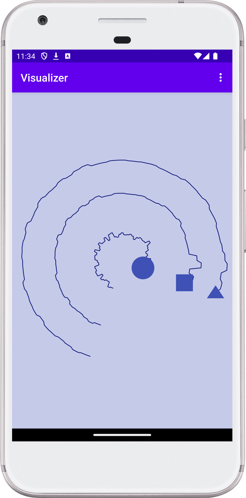
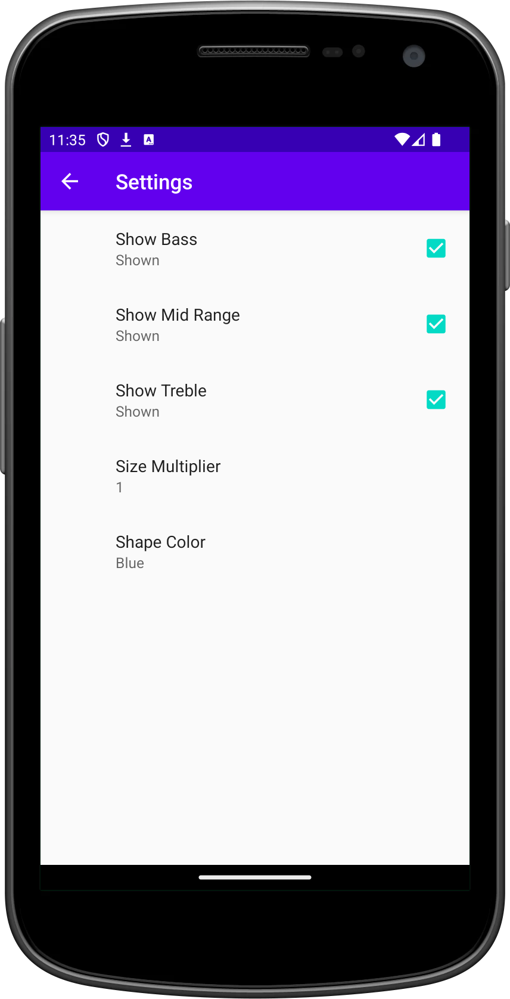

# Audio Visualizer

This Android project demonstrates how to create an audio visualizer using the
Visualizer class. It also showcases the use of SharedPreferences and custom
settings to allow the user to customize the visualizer's appearance and
behavior.

## Value

This project is valuable for developers who want to learn how to:
Use the Visualizer class to create audio visualizations.
Implement custom settings using SharedPreferences and PreferenceFragmentCompat.
Handle runtime permissions for audio recording.
Create custom views for displaying data.

## Key classes

- **MainActivity**: This activity is responsible for setting up the visualizer
- view, handling audio permissions, and managing the audio input reader. It
- also interacts with the SharedPreferences to apply user settings.
- **SettingsFragment**: This fragment provides a user interface for
- customizing the visualizer's settings. It uses PreferenceFragmentCompat to
- display a list of customizable options, such as color, size, and frequency
- bands to display.

## Features

- Real-time audio visualization.
- Customizable visualizer settings:
    - Color
    - Size
    - Displayed frequency bands (bass, mid-range, treble)
- Runtime permission handling for audio recording.

## Note

This project is intended as an educational sample and may require further
development for production use.

## Screenshots:

<!--suppress CheckImageSize -->

<!--suppress CheckImageSize -->

## Contact:

For any inquiries or suggestions, please open an issue on the GitHub repository
or reach out to me directly at
[dmytro@turskyi.com](mailto:dmytro@turskyi.com).